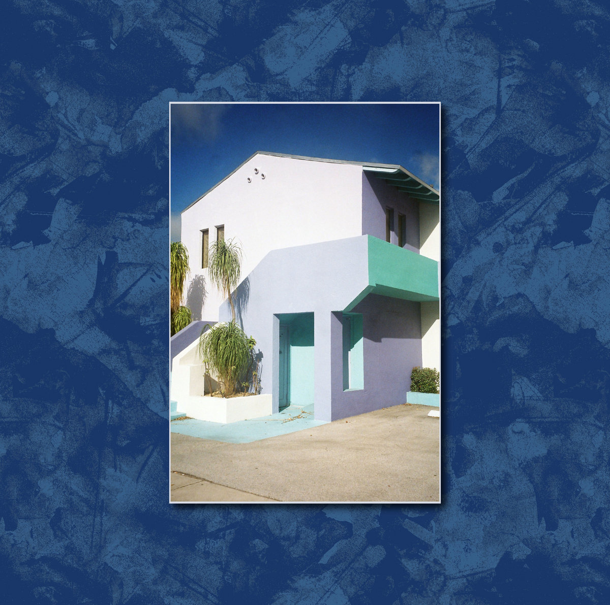

# Music in 2020

Collected some of my favourites from 2020 below, in no particular order. Skews ambient, no surprise there.

## Pontiac Streator :: Triz

Probably my favorite ambient record of the year.

<iframe style="border: 0; width: 100%; height: 42px;" src="https://bandcamp.com/EmbeddedPlayer/album=2983654696/size=small/bgcol=ffffff/linkcol=0687f5/artwork=none/transparent=true/" seamless><a href="https://motionward.bandcamp.com/album/pontiac-streator-triz">Pontiac Streator - &#39;Triz&#39; by Motion Ward</a></iframe>

---

## AV Moves :: In a Pause

<iframe style="border: 0; width: 100%; height: 42px;" src="https://bandcamp.com/EmbeddedPlayer/album=1389016902/size=small/bgcol=ffffff/linkcol=0687f5/artwork=none/transparent=true/" seamless><a href="https://a-v-c.bandcamp.com/album/in-a-pause">In A Pause by AV Moves</a></iframe>

---

## YAMAAN :: 幻想区域 EP

<iframe style="border: 0; width: 100%; height: 42px;" src="https://bandcamp.com/EmbeddedPlayer/album=2294602674/size=small/bgcol=ffffff/linkcol=0687f5/artwork=none/transparent=true/" seamless><a href="https://doteirecords.bandcamp.com/album/ep">幻想区域 EP by YAMAAN</a></iframe>

---

## Charli XCX :: How I'm Feeling Now

---

## Asa Tone :: Temporary Music

<iframe style="border: 0; width: 100%; height: 42px;" src="https://bandcamp.com/EmbeddedPlayer/album=1028926415/size=small/bgcol=ffffff/linkcol=0687f5/artwork=none/transparent=true/" seamless><a href="https://asatone.bandcamp.com/album/temporary-music">Temporary Music by Asa Tone</a></iframe>

---

## Ulla :: Tumbling Towards a Wall

<iframe style="border: 0; width: 100%; height: 42px;" src="https://bandcamp.com/EmbeddedPlayer/album=404644490/size=small/bgcol=ffffff/linkcol=0687f5/artwork=none/transparent=true/" seamless><a href="https://ullastraus.bandcamp.com/album/tumbling-towards-a-wall">Tumbling Towards a Wall by Ulla</a></iframe>

---

## DJ Python :: Mas Amable

<iframe style="border: 0; width: 100%; height: 42px;" src="https://bandcamp.com/EmbeddedPlayer/album=3334571118/size=small/bgcol=ffffff/linkcol=0687f5/artwork=none/transparent=true/" seamless><a href="https://djpythonnyc.bandcamp.com/album/mas-amable">Mas Amable by DJ Python</a></iframe>

---

## Ichiko Aoba (青葉市子) :: Windswept Adan (アダンの風)

<iframe style="border: 0; width: 100%; height: 42px;" src="https://bandcamp.com/EmbeddedPlayer/album=779512058/size=small/bgcol=ffffff/linkcol=0687f5/artwork=none/transparent=true/" seamless><a href="https://ichikoaoba.bandcamp.com/album/windswept-adan">Windswept Adan by Ichiko Aoba</a></iframe>

---

## YT :: Opinion

<iframe style="border: 0; width: 100%; height: 42px;" src="https://bandcamp.com/EmbeddedPlayer/album=1630655238/size=small/bgcol=ffffff/linkcol=0687f5/artwork=none/transparent=true/" seamless><a href="https://quiettimetapes.bandcamp.com/album/yt">YT by Opinion</a></iframe>